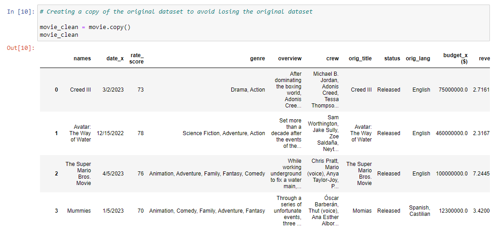

# IMDb-Analysis

## Introduction
Founded by Col Needham in October 1990, **IMDb (Internet Movie Database)** is one of the most popular movie sources today which covers statistics and details of movies, TV shows, and celebrities, including their year of release, ratings, and reviews. It cuts across many countries in the world. Currently, IMDb is owned by Amazon.

The IMDb analysis is a project that explores a movie dataset to understand the different factors that affect revenue generation from all the movies across numerous genres. Movie genres that IMDb dataset cover include Action, Thriller, Crime, Drama, Romance, etc. Other details aimed at being discovered from this project include the relationship between the movie budget and movie revenue. Jupyter Notebook was the IDE (Integrated Development Environment) that was used for writing, debugging, and running the Python code during the processes of data cleaning and visualization of the IMDb dataset. 

**_Disclaimer_**: _The IMDb image (just before the introduction) was gotten from stickpng.com and has only been used for illustrative purposes. Also, the dataset does not represent the company. It has been utilized to demonstrate the various functions in Python._

## Skills Demonstrated
* Data importation
* Duplicate check
* Column extraction
* Null values removal
* Column renaming
* Data type change
* EDA (Exploratory Data Analysis)

## Problem Statement
* What is the relationship between revenue and budget?
* Investigate the revenue generated over the years.
* Which country generated the highest movie revenue?
* What is the highest-rated movie, and to what genre does it belong?
* By revenue, what was the least popular movie genre?
* What movie genre generated the highest revenue?
* Does the movie budget affect movie ratings?
* What is the correlation between movie revenue and movie ratings?
* Evaluate any major revenue drops over the years, and what could be the reasons?

## Data Sourcing
The IMDb movie dataset was sourced from [Kaggle](https://www.kaggle.com/datasets/ashpalsingh1525/imdb-movies-dataset/data). This dataset consists of 10,178 rows and 12 columns.

## Data Cleaning
Python (on Jupyter Notebook) was used for the cleaning and transformation of this dataset. Below are the libraries imported for the data cleaning and visualization. Pandas library was the most used library during the data cleaning stage

The cleaning process entailed the following steps:
* **Python Libraries:**

It was through these library functions that the dataset could be accessed, manipulated, and visualized throughout the project. Pandas, Matplotlib, and Seaborn were mostly used throughout the project.

***

* **Data Importation:**

Using the Pandas function (pd.read_csv), the imdb movie dataset was imported into jupyter notebook.

After importing the raw dataset, it was loaded to see an overview of some rows and columns in the Jupyter notebook.

---

* **Data Info:**

This function (.info) shows the details of the number of columns and rows, including the data type and the non-null values which will invariably give an idea of the null values in the columns. 

The 12 columns are indexed (0 - 11), while the rows that are not up to 10,178 indicate the possibility of null values in the respective columns when scanning the information horizontally.

---

* **Summary Statistics:**

Numerical statistics of columns are being summarized using the '.describe' function.

---

* **Data Duplicate:**

To avoid losing the original dataset or tampering with its values, a copy of the dataset was made and the data manipulations were done on the data copy.

---

* **Rows and Columns Count:**

The total number of rows and columns of the dateset was seen using the '.shape' function.

---

* **Duplicate Check:**

Similar entries that appeared more than once across all rows were checked using '.duplicated()'

According to the result, there were no duplicates in the dataset.

---

* **Null Values Check:**
  
Checks for empty roles or null values were done.

The findings showed that 2 columns had null values.

---

* **Column Renaming:**

The movie rating column was renamed from 'rate_ score' to 'rate_score' to close down the space after the hyphen. Using 'inplace = True' made the change permanent. 

---

* **Null Values (Further Analysis):**

Using the functions '.isnull().sum()', it was possible to assess the columns that had null values and the number of entries that were null.

---

* **Null Rows in Genre Column:**

The dataset was subsected to show the rows that were null in the Genre column.

---

* **Null Rows in Crew Column:**

Entries that were null in the Crew column were also assessed.

---

* **Null Removal in Genre Column:**

This was carried out by replacing the null values with "Not Available", and also using 'inplace = True' to make the change permanent.

---

* **Null Removal in Crew Column:**

Similar to the function that was applied when removing the null values in the Genre column, same was replicated for the Crew column.

---

* **Data Type Change:**

The Date column (date_x) data type was changed from object to datetime for ease of sorting the data and to provide data validation.

---

* **Data Type Change Verification:**

Proof that the data type of 'date_x' was changed successfully.

---

* **Date Format Change:**

The date format of the Date column was changed from mm-dd-yy to the standard format in Python, which is yyyy-mm-dd.

The data type of 'date_x' went back to object during the date format change, so it was changed back to datetime data type.

---

* **Column Extraction:**

Year entries from 'date_x' were exttracted into a new column that was created and named 'year'.

The data type of the Year column was left as int32 for ease of manipulation during the exploratory data analysis (EDA).

---

* **Primary Genre Column:**

From the Genre column, a primary genre column (main_genre) was formed by extracting the first entries of every row in the Genre column after seprating them by comma (,) as the delimeter.

---

* **Movie Genres Count:**

All genres that were covered in the dataset were displayed using the '.value_counts()' function.

## EDA

Plotting and visualizing the dataset were done at this stage of the project. In terms of Python libraries, Matplotlib and Seaborn were frequently used for the plots. 

* **Budget Spread on Box Plot:**

From the box plot, 75% of the data in the Budget column was a little over $100,000.00, and from that point down to $1.00 (the minimum budget). More details on the percentiles are in the summary statistics. Outliers exist in this column, as seen in the plot, and they were not altered.

---

* **Revenue Spread on Box Plot:**

It is evident from the plot that 75% of the data in the Revenue column were between $400,000.00 and $0.00 (the minimum revenue). A detailed analysis of the percentiles, and interquartile range are in the summary statistics. There are outliers in the revenue, similar to the budget box plot.

---

* **Correlation between Budget and Revenue:**

A positive correlation was discovered between the budget and revenue in the movies, after using the '.corr' function.

This plot further demonstrates the correlation by visualizing the positive relationship between the movie budget and revenue.

---

* **Revenue Over the Years:**

Throughout the years covered in the movie dataset, this is a view of the total revenue (per year) in descending order. The year remains the index while revenue serves as the values.

The 'total revenue by year' was further narrowed down to the last 15 years for analysis. Note that the highest revenue was not made in 2023 (the most recent year in the dataset).

---

* **Line Plot Showing Revenue over the Last 15 Years:**

After grouping the revenue by year, a line plot was done to understand how the revenue has been over the last 15 years, with the revenue on the y-axis and year on the x-axis.

The line plot showed that there was a significant drop in revenue between 2022 and 2023, from $360,337,605,160.60 to $122,545,806,321.00, which was a major cause for concern.

---

* **Possible Reason for Revenue Loss between 2022 and 2023 (Rate Score):**

Knowing that there was a revenue drop between 2022 and 2023, there was a need to look into the factors that may have resulted in the loss in 2023. Out of 211 movies that had a movie rating of zero (0), 153 were associated with the year 2023.

---

* **Movie Genre with the Least Revenue:**

Of all movie genres, 'History' generated the least revenue.

---

* **Budget Vs Revenue in the Last 5 Years:**

A comparison between the budget and revenue in the last 5 years was done to see the trend and likely reason for the drop in revenue between 2022 and 2023. 

Despite the connection between budget and revenue, it was not guaranteed that budget was the main reason for the revenue loss in 2023.

---

* **Revenue by Country:**

Computing the revenue and grouping by country was done to see the top 5 nations that generated the most income from movies. The countries were left as index and revenues were left as values.

Countries (as index) were on the y-axis, while revenue (as values) was on the x-axis.

The top 5 countries by revenues are shown in the horizontal bar plot, with Australia generating $942,538,506,953.40 from movies ahead of other countries.

---

* **Revenue by Genre:**

The generated revenue by genre was also evaluated. Just like the previous horizontal bar plot, genre was retained as the index and revenue was left as the values.

The top 5 genres in terms of revenue were investigated. Genre was on the y-axis while revenue was on the x-axis, as genre was plotted against revenue.

Evidently, 'Drama' generated the highest revenue ($417,039,912,957.00) of all the movie genres in the dataset.

---

* **Highest Rated Movies by Genre:**

In terms of movie ratings, the highest score was 100, and the least score was 0. This table shows the top-rated movies by genre, and nine (9) movies had a rating of 100. 'Drama' had 5 movies (out of 9) with a rating of 100 which was the highest.

---

* **Correlation between Budget and Movie Rating:**

There was no correlation between the budget and movie ratings, which is to say that the size of the budget had no effect on the movie rating.

This scatter plot further explains that movie ratings are independent of the movie budget.

---

* **Relationship between Revenue and Movie Ratings:**

From the scatter plot, it is clear that the movie ratings are not dependent on revenue, as there is no direct connection between both columns.

---

* **Likely Reason(s) for Revenue Loss Between 2022 and 2023:**

**a)i. Count and Average of Movies in 2022 (by Genre):**

The total count of movies (by genre) in 2022 was evaluated. 'Drama' topped the group, followed by 'Commedy' and then 'Action'.

The average number of movie (by genre) produced in 2022 was 47.7.

**ii. Count and Average of Movies in 2023 (by Genre):**

In 2023, the total number of movies (by genre) was assessed. Similar to that of 2022, it was 'Drama', 'Comedy', and 'Action', but the count of movies was lower.

As seen, the average count of movies (by genre) in 2023 was 20.15, which was approximately 58% less than the average in 2022.

**b)i. Revenue Vs Status of Movies:**

The status column was assessed using the '.value_counts()' function, and this showed that not all movies in the movie dataset were released.

In direct comparison, 2022 had a total of 954 released movies.

Compared to 2023, which had just 356 movies released, approximately 63% less than the released figure in 2022, this could have a huge impact on 2023 movie revenue.

## Conclusion
* The highest revenue ($360,337,605,160.60) was generated was in 2022
* 2023 had the largest number of movies with a zero (0) movie rating, but there was no correlation between movie ratings and revenue.
* A higher movie budget can result in higher movie revenue when the movies are released.
* Of all genres, the one with the least revenue was 'History', and 'Drama' had the highest revenue generated.
* Australia generated the most revenue ($942,538,506,953.40) from movies over the years.
* Due to the correlation between budget and revenue, a lesser budget may have led to reduced revenue when comparing 2022 (budget: $82,777,700,295.60) and 2023 (budget: $49,874,542,778.00).
* By genre, it was by approximately 58% that the average count of movies in 2023 (20.15) was less than the average count of movies in 2022 (47.7), so it can be deduced that the drop in revenue between 2022 and 2023 could be a result of the number of movies that were available.
* The status of the movie was also a factor that could possibly influence the revenue loss between 2022 and 2023 because only 356 movies were released in 2023, which was approximately 63% less than the number released in 2022 (954), hence the reason for the decline in revenue.

## Recommendation
* More data like movie subtitles, would be great so as to investigate further the effect it has on movie revenue and ratings.
* Further movie classifications, like seasonal movies, TV shows, etc, can improve analysis in the future to aid in finding out the popular preferences amongst viewers.

